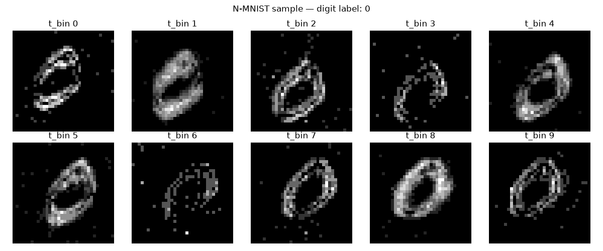
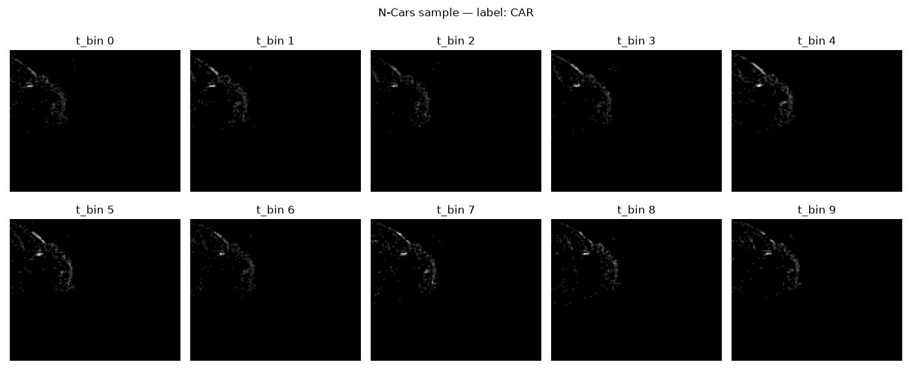

# Neuromorphic-Event-Camera-Perception-for-Automotive-Applications
Neuromorphic perception for automotive edge AI — training spiking neural networks on real event-camera driving data (N-Cars), with a custom binary sensor parser and a rigorous SNN vs. CNN benchmark (accuracy, spikes/FLOPs, latency).


Exploring spiking neural networks (SNNs) for low-power, automotive-grade object
perception using event-camera data — motivated by neuromorphic engineering as an
active research direction in automotive R&D (e.g. Mercedes-Benz Research &
Development India's neuromorphic engineering track with IIT Delhi).

This project evaluates whether spiking neural networks can serve as an
energy-efficient alternative to conventional CNNs for automotive perception
tasks, using real event-camera driving data.

---

## Motivation

Conventional CNN-based perception (e.g. lane/obstacle detection) processes every
pixel of every frame, regardless of whether anything changed. Event cameras only
report per-pixel brightness *changes*, producing sparse, asynchronous data that
is a natural fit for spiking neural networks — which only compute when a neuron
"fires." On dedicated neuromorphic hardware (e.g. Intel Loihi, BrainChip Akida),
this sparsity translates into large power savings, which matters for
compute-constrained, always-on ADAS systems.

This project builds toward that idea in three stages:
1. Learn event-data representations and SNN training on a toy dataset (N-MNIST)
2. Apply the same pipeline to real automotive event-camera data (N-Cars)
3. Benchmark the SNN against a conventional CNN on accuracy, compute cost, and
   latency, to understand the actual tradeoffs involved

---

## Pipeline Overview

```
N-MNIST (toy dataset, digit classification)
        │  learn event data + SNN training basics
        ▼
Custom Prophesee .dat parser
        │  tonic dropped native N-Cars support (deprecated Loris dependency),
        │  so raw event binary format was parsed manually
        ▼
N-Cars dataset (real ATIS event-camera driving footage, car vs. background)
        │
        ├──► Spiking Neural Network (conv + LIF neurons)
        └──► Conventional CNN baseline (same architecture, dense compute)
                    │
                    ▼
        Head-to-head comparison: accuracy / compute / latency
```

---

## Stage 1 — N-MNIST Baseline

A simple fully-connected SNN (2 `snn.Leaky` layers) trained on N-MNIST to
validate the event-data loading and SNN training pipeline before moving to
automotive data.

- **Library:** `tonic` for event data loading/binning, `snnTorch` for the
  spiking network
- **Result:** **91.18% test accuracy** after 2 epochs


*Ten time-bin event frames of a handwritten digit "0" — the digit outline
builds up as events accumulate over time, unlike a static photo.*

---

## Stage 2 — Custom Event Data Parser (N-Cars)

`tonic`'s built-in `NCARS` dataset class was removed in recent versions due to
a deprecated dependency, so the raw Prophesee `.dat` binary format was parsed
from scratch:

- Header: ASCII lines prefixed with `%`, followed by a 2-byte event
  type/size field
- Each event: 8 bytes total — 4-byte timestamp (uint32) + 4-byte packed
  data (uint32), little-endian
- Packed data: 14 bits x-position, 14 bits y-position, 1 bit polarity

Events are then binned into 10 discrete time-step frames (matching the
approach used for N-MNIST) via a vectorized NumPy scatter-add operation for
performance across ~15,400 files.


*Real event-camera driving footage — visible car outline (roofline/windshield
edge) recorded from an ATIS camera mounted behind a car's windshield.*

---

## Stage 3 — SNN Car Detector (N-Cars)

**Dataset:** N-Cars (Prophesee/HATS) — 7,940 car / 7,482 background training
samples, 4,396 car / 4,211 background test samples, real urban driving
footage, 120×100 resolution.

**Architecture:** Convolutional SNN — `Conv2d → Leaky` (×2) → `MaxPool` →
`Linear → Leaky` (×2), processing 10 sequential time-bin frames per sample.

**Training:** Adam optimizer, step LR schedule, 8 epochs.

| Iteration | Architecture | Test Accuracy |
|---|---|---|
| v1 | Fully-connected SNN | 78.78% |
| v2 | Convolutional SNN | **85.92%** |

Adding spatial structure via convolution (rather than immediately flattening
pixels) improved accuracy by ~7 points, confirming that spatial locality
matters for this task even in the spiking domain.

---

## Stage 4 — CNN Baseline & Comparison

A conventional CNN with matched architecture (same conv/pool/linear layer
sizes, ReLU instead of spiking neurons, static collapsed frame instead of
10 sequential time bins) was trained on the identical N-Cars train/test split
for a fair, matched-capacity comparison.

### Results

| Metric | CNN (conventional) | SNN (neuromorphic) |
|---|---|---|
| Test Accuracy | **89.23%** | 85.92% |
| Compute per inference | 24,737,536 FLOPs | 58,239 spikes |
| CPU inference latency | **0.780 ms** (±0.293) | 27.605 ms (±3.579) |

### Interpretation

- **Accuracy:** The CNN outperforms the SNN by ~3.3 points, consistent with
  the general finding that dense computation typically outperforms sparse
  spike-based computation at this scale without extensive tuning.
- **Compute cost:** The SNN requires roughly 3 orders of magnitude fewer
  operations (spikes vs. FLOPs) to reach a comparable decision — this is the
  theoretical basis for neuromorphic hardware's power efficiency advantage in
  always-on, edge-deployed automotive perception.
- **Latency (the key nuance):** Despite the far lower operation count, the
  SNN is ~35x *slower* than the CNN when run on a conventional CPU. This is
  expected: CPUs/GPUs simulate spiking behavior as dense tensor operations
  over each timestep, with no hardware mechanism to skip computation when a
  neuron doesn't fire. The SNN's efficiency advantage only materializes on
  **dedicated neuromorphic hardware** (e.g. Intel Loihi 2, BrainChip Akida)
  designed to exploit sparsity at the silicon level — which is precisely why
  neuromorphic computing remains an active hardware/software co-design
  research area rather than a drop-in replacement for CNNs on today's
  general-purpose processors.

---

## Key Takeaways

1. Built a complete event-camera perception pipeline from raw binary sensor
   data to a trained classifier, including writing a custom parser after a
   standard library dropped support for the dataset's format.
2. Demonstrated that architectural choices (convolutional vs. fully-connected
   spiking layers) meaningfully affect SNN performance, mirroring standard
   CNN design principles.
3. Quantified the real accuracy/compute/latency tradeoffs between spiking and
   conventional networks on identical data and matched architectures, and
   correctly attributed the latency gap to hardware/software mismatch rather
   than a fundamental limitation of the spiking approach.

## Tech Stack

`Python` · `PyTorch` · `snnTorch` · `tonic` · `NumPy` · `matplotlib`

## Datasets

- [N-MNIST](https://www.garrickorchard.com/datasets/n-mnist) (Orchard et al., 2015)
- [N-Cars](https://www.prophesee.ai/2018/03/13/dataset-n-cars/) (Sironi et al., HATS, CVPR 2018)

## Possible Future Work

- Extend to full object detection (bounding boxes) on the Prophesee Gen1
  Automotive Detection Dataset
- Deploy/simulate on neuromorphic hardware or a cycle-accurate simulator to
  obtain real energy measurements instead of a spike-count proxy
- Explore hybrid CNN-SNN architectures to recover some of the accuracy gap
